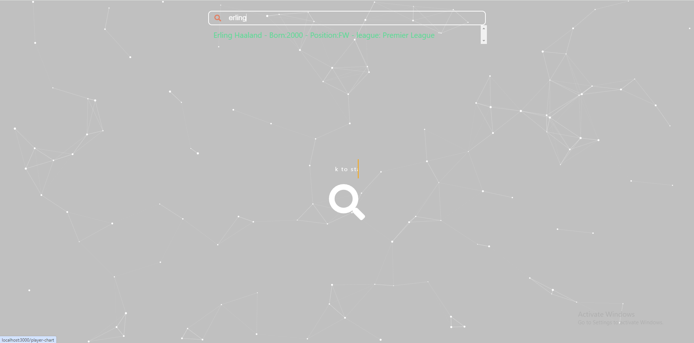
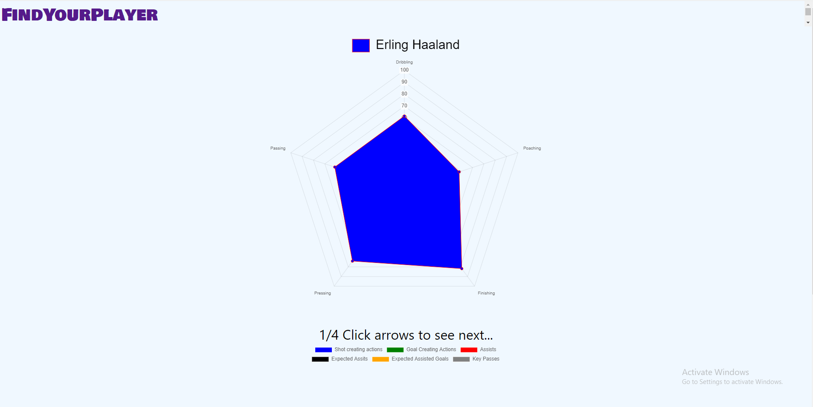
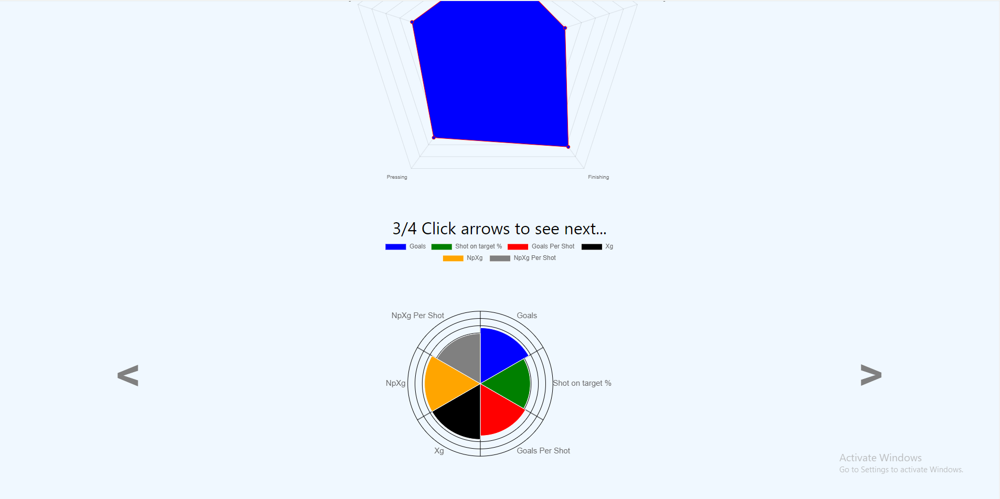
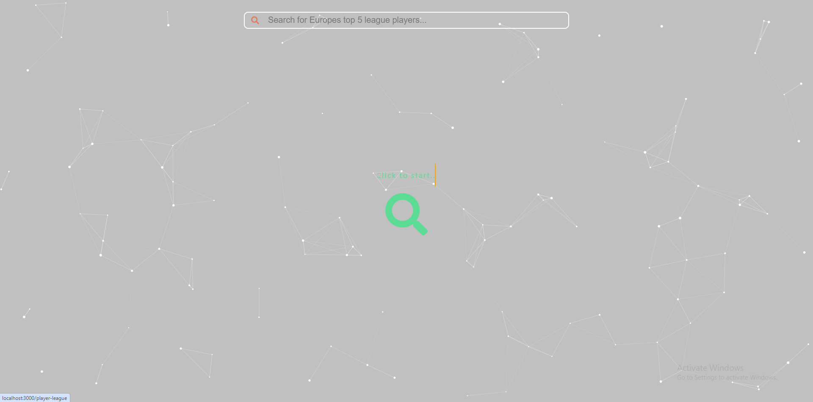
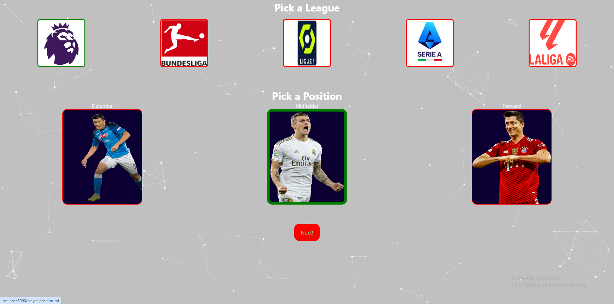
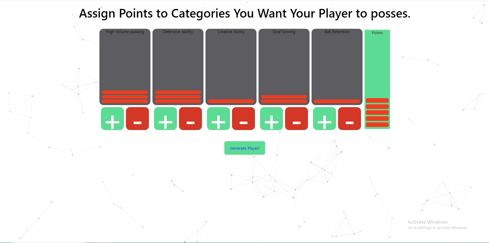
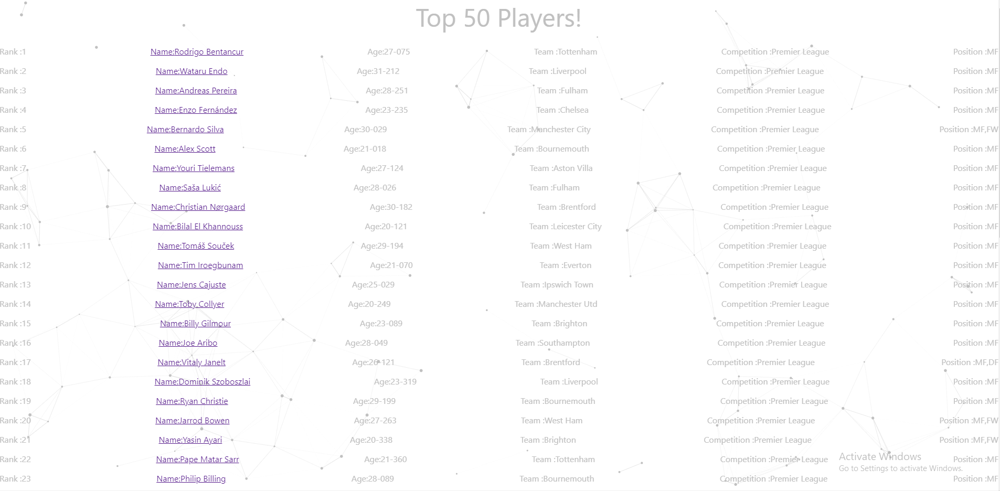
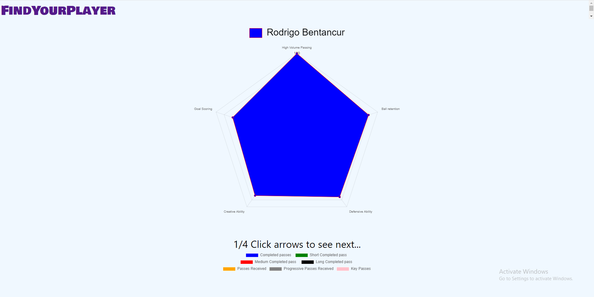

# FindYourPlayer
### Built with
* [![React][React.js]][React-url]
* [![Express][Express.js]][Express-url]
* [![Python][Python.py]][Python-url]
* [![BeautifulSoup][BeautifulSoup.py]][BeautifulSoup-url]
* [![Postgres][Postgresql]][Postgresql-url]

# About the Project

This project is a tool for football enthusiasts and analysts. It allows users to search for their desired player within europe's top 5 leagues and view percentile statistics and graphs on the player.
You can also find new exciting players by searching for players by attributes such as chances created, defending, ball retention etc.

### Key Features:
- **Search By Player names or attributes**: Locate players by their name or do a custom search to find players who fit what attributes you are looking for.
- **Stats and Graphs**: View percentile statistics and percentile graphs.

# Usage
#### When you get to the landing page, there will be two options. You can either search by name of click the magnifying glass in the middle of the screen and search for players by attributes.

#### Searching by name will cause a list of players to show up that match your search.

#### After clicking on the player it will bring you to a graph with the most important percentile statistics for that players particular position.

#### If you scroll down, you can also view more in depth percentile statistics and the some of the more specific data points in the view of a graph. Clicking the arrows allows u to move between diffrent categories of statistics.

#### Although if you want a custom search you can click on the arrow in the middle of the screen.

#### This will bring you to a page where you can specify the positon of the player you want to search for and the league in which they play in.

#### After specifying league and position, you will be taken to a page and shown categories based on the position you chose. By adding the points, shown on the right hand side, by clicking the + symbol, you can decide primarly what characteristics you want your player to have. For example, if all the points where added to the creative ability category, it would give you the player with the best creative ability, filtered by league and position you chose. If you want to find the best all round player, you can divide the points between the categories equally. All points must be used to proceed.

#### After clicking "Generate Player" you will be shown a list of the top 50 players who matched your description. The first player will be who fit the description best.

#### You can also click on the name of that player, in which it will bring you to the stats of said player.

## Contact
#### Afolabi Adekanle - afolabiadekanle@gmail.com - [![linkedin][linked-in][LinkedIn-url]
<!-- MARKDOWN LINKS & IMAGES -->
[React.js]: https://img.shields.io/badge/React-20232A?style=for-the-badge&logo=react&logoColor=61DAFB
[React-url]: https://reactjs.org/
[Express.js]: https://img.shields.io/badge/Express%20js-000000?style=for-the-badge&logo=express&logoColor=white
[Express-url]: https://expressjs.com/
[BeautifulSoup.py]:https://shields.io/badge/BeautifulSoup-4-green
[BeautifulSoup-url]:https://pypi.org/project/beautifulsoup4/
[Python.py]:https://img.shields.io/badge/python-3670A0?style=for-the-badge&logo=python&logoColor=ffdd54
[Python-url]:https://www.python.org/
[Postgresql]:https://img.shields.io/badge/postgresql-4169e1?style=for-the-badge&logo=postgresql&logoColor=white
[Postgresql-url]:https://www.postgresql.org/
[linked-in]: https://img.shields.io/badge/LinkedIn-0077B5?style=for-the-badge&logo=linkedin&logoColor=white
[LinkedIn-url]: https://www.linkedin.com/in/afolabi-adekanle-68428b1b6/

