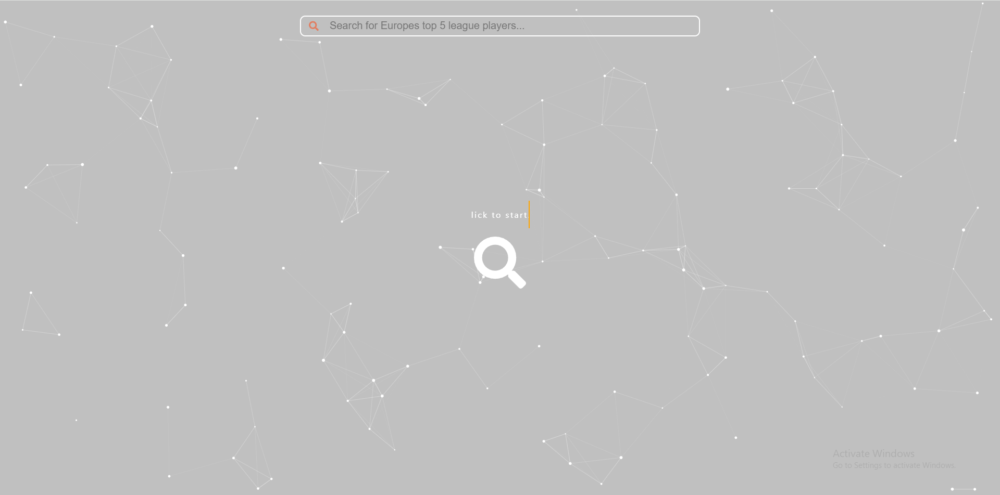

# FindYourPlayer
### Built with
* [![React][React.js]][React-url]
* [![Express][Express.js]][Express-url]
* [![Python][Python.py]][Python-url]
* [![BeautifulSoup][BeautifulSoup.py]][BeautifulSoup-url]
* [![Postgres][Postgresql]][Postgresql-url]

# About the Project

This project is a tool for football enthusiasts and analysts. It allows users to search for their desired player within europe's top 5 leagues and view percentile statistics and graphs on the player.
You can also find new exciting players by searching for players by attributes such as chances created, defending, ball retention etc.

### Key Features:
- **Search By Player names or attributes**: Locate players by their name or do a custom search to find players who fit what attributes you are looking for.
- **Stats and Graphs**: View percentile statistics and percentile graphs.

# Usage
### When you get to the landing page, there will be two options. You can either search by name of click the magnifying glass in the middle of the screen and search for players by attributes.

## Contact
<!-- MARKDOWN LINKS & IMAGES -->
[React.js]: https://img.shields.io/badge/React-20232A?style=for-the-badge&logo=react&logoColor=61DAFB
[React-url]: https://reactjs.org/
[Express.js]: https://img.shields.io/badge/Express%20js-000000?style=for-the-badge&logo=express&logoColor=white
[Express-url]: https://expressjs.com/
[BeautifulSoup.py]:https://shields.io/badge/BeautifulSoup-4-green
[BeautifulSoup-url]:https://pypi.org/project/beautifulsoup4/
[Python.py]:https://img.shields.io/badge/python-3670A0?style=for-the-badge&logo=python&logoColor=ffdd54
[Python-url]:https://www.python.org/
[Postgresql]:https://img.shields.io/badge/postgresql-4169e1?style=for-the-badge&logo=postgresql&logoColor=white
[Postgresql-url]:https://www.postgresql.org/

